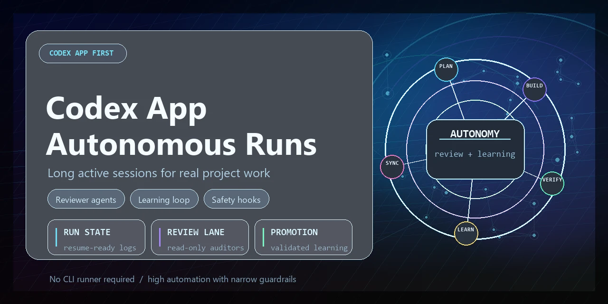
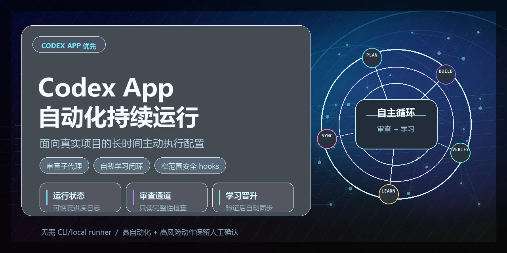
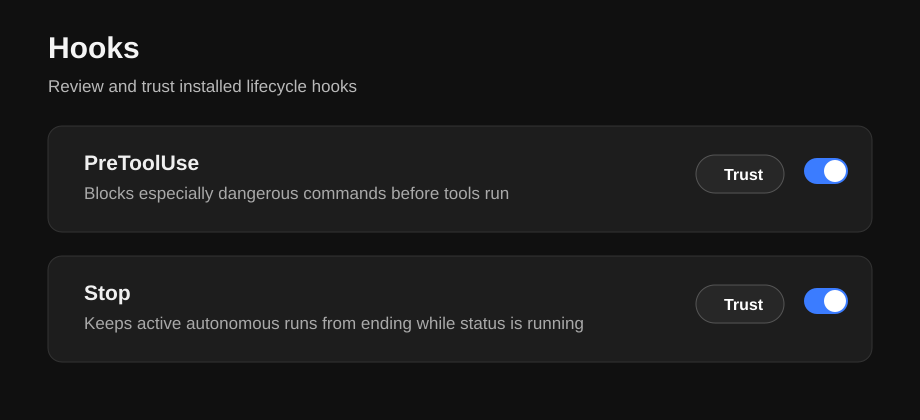

# Codex App Autonomous Runs



<details>
<summary>中文宣传图</summary>



</details>

## Introduction

<details open>
<summary>English</summary>

Codex App configuration templates for long active autonomous project runs.

The goal is high automation without turning every step into a permission prompt:
normal engineering work keeps running, while only especially dangerous actions are
blocked by rules and hooks.

This project is intentionally Codex App first. It does not depend on a CLI/local
runner for continuous work.

</details>

<details>
<summary>中文</summary>

Codex App Autonomous Runs 是一套面向 Codex App 的全局配置模板，用来支持长时间、持续推进的自主项目运行。

它的目标是在不牺牲安全边界的前提下提高自动化率：常规开发、测试、构建、提交、分支推送和 PR 创建可以持续进行，只有发布、生产部署、基础设施变更、递归强删、密钥写入等特别高风险操作才触发人工确认。

这个项目坚持 Codex App 优先，不依赖 CLI 或本地 runner 来实现持续工作。

</details>

## What It Adds

- Global `AGENTS.md` rules for timed autonomous runs.
- A `timed-autonomous-run` skill for App-only long active sessions.
- Machine-checkable run state:
  - `run-state.json`
  - `progress.md`
  - `progress.jsonl`
  - `current`
- Read-only reviewer agents:
  - `project_completeness_reviewer`
  - `autonomous_reviewer`
  - `security_reviewer`
  - `test_coverage_reviewer`
  - `architecture_reviewer`
  - `ui_artifact_reviewer`
- Narrow safety rules and hooks that allow normal coding, tests, builds, branch
  pushes, and PR creation, while blocking especially dangerous operations.

## Safety Boundary

Allowed by default:

- reading and editing project files
- tests, lint, typecheck, builds
- local dev servers and previews
- commits, branch pushes, and PR creation when requested
- reviewer subagents

Blocked by default:

- package publishing
- deploys and production deploys
- infrastructure changes
- Kubernetes/Helm changes
- destructive Git cleanup
- recursive force deletion
- secrets/private key writes
- direct destructive database command prefixes

## Install

Review the templates first:

```powershell
Get-ChildItem .\templates\codex -Recurse
```

Preview installation:

```powershell
.\scripts\Install-CodexAppAutonomous.ps1 -Merge -DryRun
```

Install into your Codex home:

```powershell
.\scripts\Install-CodexAppAutonomous.ps1 -Merge
```

macOS/Linux or cross-platform Node install:

```bash
node scripts/install.mjs --merge --dry-run
node scripts/install.mjs --merge
```

Then open Codex App settings and trust the installed hooks.



## Validate

```powershell
npm run test:all
```

The full validation checks template completeness, safety-rule semantics, example
projects, fixture behavior, hook performance, and obvious secret or personal-path
leaks.

## Uninstall

Preview:

```powershell
.\scripts\Uninstall-CodexAppAutonomous.ps1 -DryRun
node scripts/uninstall.mjs --dry-run
```

Remove installed files:

```powershell
.\scripts\Uninstall-CodexAppAutonomous.ps1
```

Installers write `codex-app-autonomous-manifest.json` into your Codex home.
Uninstall uses that manifest and file hashes to remove only matching managed files.
Modified or user-owned `hooks.json` is preserved.

## Usage

In Codex App, ask for an App-side active run, for example:

```text
Use Codex App only. Run this project for 2 hours, keep working automatically,
use human checkpoints only for especially dangerous actions, and use a read-only
project completeness reviewer.
```

For medium and large projects, the expected pattern is one main agent doing the
work plus one read-only project completeness reviewer. Specialized reviewers are
used only when the project risk warrants them.

For timed autonomous runs of 1 hour or more, the duration request itself is treated
as authorization to start at least one read-only reviewer subagent after orientation.

See [docs/demo.md](docs/demo.md), [docs/faq.md](docs/faq.md), and
[examples/medium-project](examples/medium-project) for a full example.

## Important Limitations

A desktop app cannot guarantee mathematically zero seconds of inactivity. This
setup maximizes continuous active work within Codex App constraints and records
state so interrupted runs can resume.

Hooks can run outside the sandbox. Review them before trusting.
