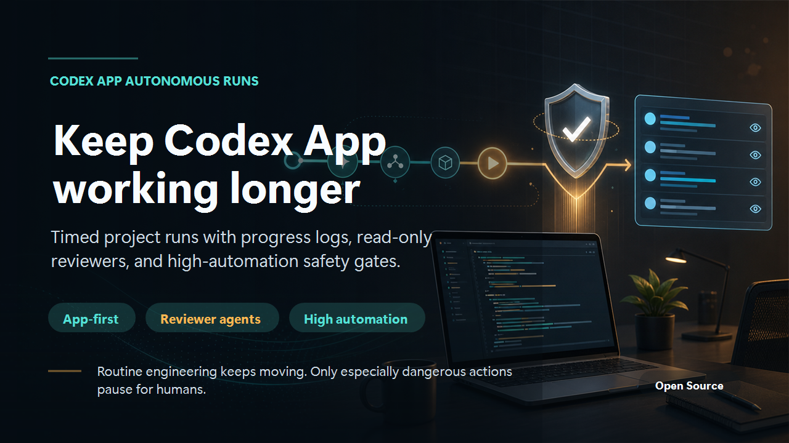
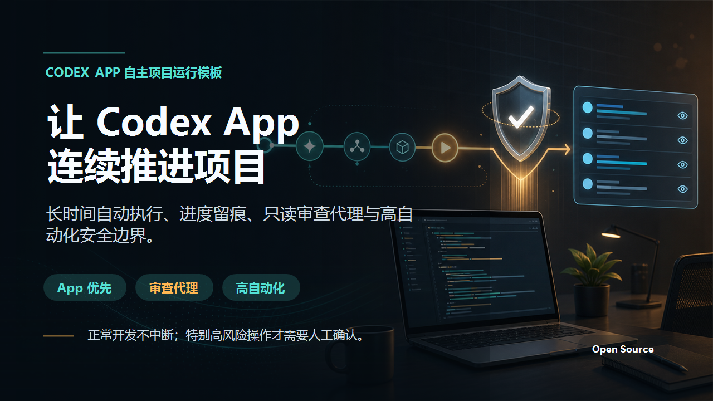

# Codex App Autonomous Runs



<details>
<summary>中文宣传图</summary>



</details>

Codex App configuration templates for long active autonomous project runs.

The goal is high automation without turning every step into a permission prompt:
normal engineering work keeps running, while only especially dangerous actions are
blocked by rules and hooks.

This project is intentionally Codex App first. It does not depend on a CLI/local
runner for continuous work.

## What It Adds

- Global `AGENTS.md` rules for timed autonomous runs.
- A `timed-autonomous-run` skill for App-only long active sessions.
- Machine-checkable run state:
  - `run-state.json`
  - `progress.md`
  - `progress.jsonl`
- Read-only reviewer agents:
  - `project_completeness_reviewer`
  - `autonomous_reviewer`
  - `security_reviewer`
  - `test_coverage_reviewer`
  - `architecture_reviewer`
  - `ui_artifact_reviewer`
- Narrow safety rules and hooks that allow normal coding, tests, builds, branch
  pushes, and PR creation, while blocking especially dangerous operations.

## Safety Boundary

Allowed by default:

- reading and editing project files
- tests, lint, typecheck, builds
- local dev servers and previews
- commits, branch pushes, and PR creation when requested
- reviewer subagents

Blocked by default:

- package publishing
- production deploys
- infrastructure changes
- Kubernetes/Helm changes
- destructive Git cleanup
- recursive force deletion
- secrets/private key writes
- destructive database operations

## Install

Review the templates first:

```powershell
Get-ChildItem .\templates\codex -Recurse
```

Preview installation:

```powershell
.\scripts\Install-CodexAppAutonomous.ps1 -Merge -DryRun
```

Install into your Codex home:

```powershell
.\scripts\Install-CodexAppAutonomous.ps1 -Merge
```

macOS/Linux or cross-platform Node install:

```bash
node scripts/install.mjs --merge --dry-run
node scripts/install.mjs --merge
```

Then open Codex App settings and trust the installed hooks.


## Validate

```powershell
npm test
```

The test verifies that templates are self-contained, hooks allow normal commands,
hooks block dangerous commands, and no personal paths or obvious secrets are present.

## Uninstall

Preview:

```powershell
.\scripts\Uninstall-CodexAppAutonomous.ps1 -DryRun
node scripts/uninstall.mjs --dry-run
```

Remove installed files:

```powershell
.\scripts\Uninstall-CodexAppAutonomous.ps1
```

## Usage

In Codex App, ask for an App-side active run, for example:

```text
Use Codex App only. Run this project for 2 hours, keep working automatically,
use human checkpoints only for especially dangerous actions, and use a read-only
project completeness reviewer.
```

For medium and large projects, the expected pattern is one main agent doing the
work plus one read-only project completeness reviewer. Specialized reviewers are
used only when the project risk warrants them.

See [docs/demo.md](docs/demo.md), [docs/faq.md](docs/faq.md), and
[examples/medium-project](examples/medium-project) for a full example.

## Important Limitations

A desktop app cannot guarantee mathematically zero seconds of inactivity. This
setup maximizes continuous active work within Codex App constraints and records
state so interrupted runs can resume.

Hooks can run outside the sandbox. Review them before trusting.
